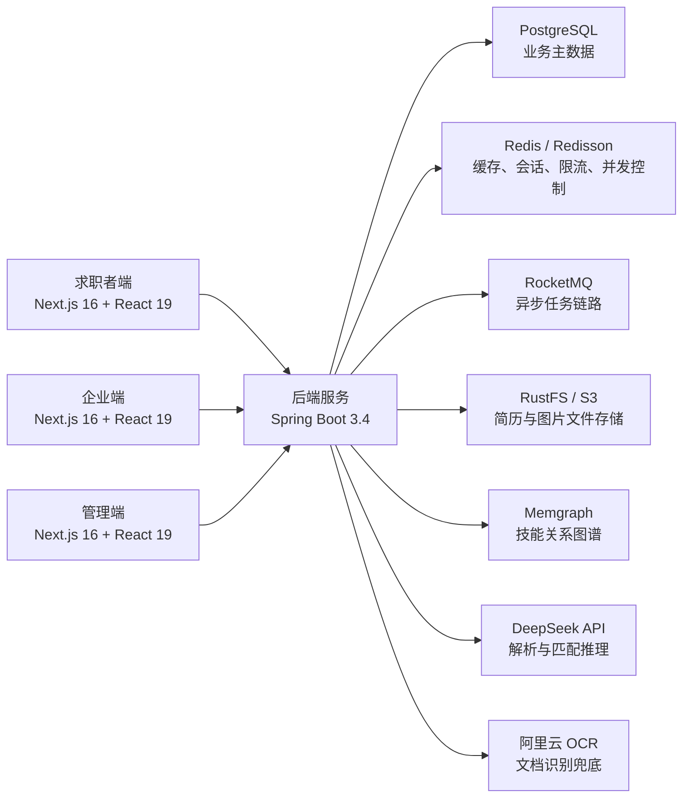

# GraphHire 图谱智聘

GraphHire 是一个面向招聘场景的 AI 智能匹配平台，围绕“简历解析 -> 职位解析 -> 能力图谱构建 -> 人岗匹配 -> 招聘协同”构建完整闭环。仓库当前包含求职者端、企业端、管理端三类前端入口，以及基于 Spring Boot 的后端服务、数据库基线脚本和本地依赖服务配置。

## 项目定位

GraphHire 关注的不只是“投递职位”，而是把招聘过程拆成可计算、可追踪、可解释的链路：

- 对求职者，提供注册登录、简历上传、职位浏览、企业查看、匹配结果、能力图谱和站内沟通能力。
- 对企业，提供职位发布、候选人推荐、企业资料维护、招聘消息协同和招聘工作台。
- 对管理员，提供企业审核、用户管理、行业管理、职位类型管理、任务监控等后台能力。
- 对 AI 和图谱链路，提供文档解析、OCR 兜底、匹配评分、匹配理由生成、技能关系图构建与异步任务调度。

## 核心能力

- 简历文档解析：支持 PDF / DOC / DOCX 上传与解析。
- 职位结构化：将职位描述转换为可用于匹配和图谱分析的结构化数据。
- 人岗匹配：基于能力标签、职位要求和图谱关系生成匹配结果与解释。
- 招聘协同：支持求职者与企业的站内消息、简历投递与候选人沟通。
- 图谱建模：基于 Memgraph 维护技能关系图，为推荐、匹配和能力分析提供支撑。
- 异步处理：基于 RocketMQ、Redis、Redisson 支撑上传、解析、匹配等异步流程。

## 系统架构



说明：

- 当前前端按业务分为 3 个端：求职者端、企业端、管理端
- 3 个端共享同一个 `frontend/` Next.js 工程，并通过不同路由前缀区分
- 本地开发时 3 个端统一由 `http://localhost:8888` 提供访问入口
- 后端默认运行在 `http://localhost:7777`
- 前端默认通过 `NEXT_PUBLIC_API_BASE_URL` 指向后端，默认值为 `http://127.0.0.1:7777`
- AI、OCR、对象存储、图数据库均为增强能力依赖；如果未配置，对应业务链路会受限

## 技术栈

### 前端

- Next.js 16
- React 19
- TypeScript 5
- Tailwind CSS
- TanStack Query
- Zustand
- Vitest + Testing Library

### 后端

- Java 21
- Spring Boot 3.4.5
- MyBatis-Plus
- Sa-Token
- Redis / Redisson
- RocketMQ
- Apache Tika
- SpringDoc OpenAPI
- Hutool

### 基础设施

- PostgreSQL
- Memgraph（Bolt 协议）
- RustFS / S3 兼容对象存储
- DeepSeek API
- 阿里云 OCR

## 仓库结构

```text
GraphHire/
├─ frontend/                              # Next.js 前端工程
│  ├─ src/app/                            # App Router 页面入口（用户端 / 企业端 / 管理端）
│  ├─ src/components/                     # 复用组件
│  ├─ src/lib/                            # API 客户端、工具函数、状态管理
│  └─ tests/                              # 前端测试根目录（Vitest）
├─ backend/                               # Spring Boot 后端工程
│  ├─ src/main/java/                      # 业务代码
│  └─ src/main/resources/
│     ├─ application.yml                  # 默认运行配置
│     └─ db/
│        ├─ schema.sql                    # 当前数据库基线结构
│        └─ migration/                    # 历史迁移脚本
├─ docs/                                  # 架构、设计、过程与仓库记忆文档
├─ logs/                                  # 本地调试输出
└─ script/                                # 本地辅助脚本与依赖服务编排
```

## 角色与入口

- 首页：`/`
- 登录/注册：`/login`、`/register`
- 求职者端：`/jobs`、`/companies`、`/resume/manage`、`/skill-graph`、`/chat`
- 企业端：`/enterprise/dashboard`
- 管理端：`/admin/login`

## 本地快速开始

### 1. 环境要求

- Node.js 20+
- npm 10+
- Java 21
- Maven 3.9+
- Docker Desktop（推荐，用于快速拉起中间件）

如果你只想先查看前端页面，启动前端即可；如果要跑通登录、上传、解析、匹配、聊天等完整链路，建议把数据库、缓存、对象存储、消息队列和图数据库一并拉起。

### 2. 启动基础依赖服务

仓库已经提供了本地 Docker Compose 配置，位于 `script/dev/services/`：

```bash
docker compose -f script/dev/services/postgres.yml up -d
docker compose -f script/dev/services/redis.yml up -d
docker compose -f script/dev/services/rustfs.yml up -d
docker compose -f script/dev/services/memgraph.yml up -d
docker compose -f script/dev/services/rocketmq.yml up -d
```

默认端口：

- PostgreSQL：`5432`
- Redis：`6379`
- RustFS API：`9000`
- RustFS Console：`9001`
- Memgraph Bolt：`7687`
- Memgraph Lab：`3000`
- RocketMQ NameServer：`9876`
- RocketMQ Dashboard：`8082`

注意：

- `backend/src/main/resources/application.yml` 默认连接数据库 `graphhire`
- `script/dev/services/postgres.yml` 当前默认创建的数据库名是 `ragent`
- 如果你直接使用这份 compose，需要二选一：
  - 把 PostgreSQL 容器里的数据库名改成 `graphhire`
  - 或通过环境变量覆盖 `DB_URL=jdbc:postgresql://localhost:5432/ragent`

### 3. 初始化数据库

1. 创建业务数据库：`graphhire`（或与你的 `DB_URL` 保持一致）
2. 执行基线脚本 [backend/src/main/resources/db/schema.sql](backend/src/main/resources/db/schema.sql)

说明：

- `schema.sql` 是当前可直接导入的完整基线结构
- `backend/src/main/resources/db/migration/` 保留了历史迁移脚本，适合追溯演进过程
- 当前仓库未体现自动迁移执行器的标准启动流程，首次启动建议优先导入 `schema.sql`

### 4. 配置后端环境变量

后端会尝试从根目录 `.env` 或 `backend/.env` 读取配置。可直接基于 [backend/.env.example](backend/.env.example) 复制一份：

```bash
cd backend
cp .env.example .env
```

常用环境变量如下：

| 变量名 | 说明 | 是否必填 |
| --- | --- | --- |
| `DB_URL` | PostgreSQL JDBC 地址，默认 `jdbc:postgresql://localhost:5432/graphhire` | 否 |
| `DB_USERNAME` | PostgreSQL 用户名，默认 `postgres` | 否 |
| `DB_PASSWORD` | PostgreSQL 密码，默认 `postgres` | 否 |
| `DEEPSEEK_API_KEY` | DeepSeek API Key，用于 AI 解析和匹配能力 | 部分场景必填 |
| `ALIYUN_OCR_ACCESS_KEY_ID` | 阿里云 OCR Key ID | OCR 场景必填 |
| `ALIYUN_OCR_ACCESS_KEY_SECRET` | 阿里云 OCR Key Secret | OCR 场景必填 |
| `MAIL_USERNAME` | 邮箱账号，用于验证码或通知发送 | 邮件场景必填 |
| `MAIL_PASSWORD` | 邮箱授权码/密码 | 邮件场景必填 |
| `RUSTFS_ACCESS_KEY` | 对象存储访问 Key | 若使用受保护对象存储则必填 |
| `RUSTFS_SECRET_KEY` | 对象存储访问 Secret | 若使用受保护对象存储则必填 |
| `RUSTFS_BUCKET` | 对象存储桶名，默认 `resumes` | 否 |
| `CORS_ALLOWED_ORIGINS` | 允许的前端跨域来源，默认 `http://localhost:8888` | 否 |
| `WS_ALLOWED_ORIGINS` | WebSocket 允许来源，默认 `http://localhost:8888` | 否 |

说明：

- 如果你只做静态页面开发，不一定需要填满所有 AI / OCR / 邮件相关配置
- 如果要验证上传、解析、聊天、通知等完整链路，建议把对象存储、邮件和 AI 配置一并补齐

### 5. 启动后端

```bash
cd backend
mvn spring-boot:run
```

后端默认监听 `7777`，接口文档默认地址为 `http://localhost:7777/swagger-ui.html`。

### 6. 启动前端

```bash
cd frontend
npm install
npm run dev
```

前端默认监听 `8888`。如需覆盖 API 地址，可设置：

```bash
set NEXT_PUBLIC_API_BASE_URL=http://127.0.0.1:7777
```

## 常用地址

- 前端首页：[http://localhost:8888](http://localhost:8888)
- 后端接口：[http://localhost:7777](http://localhost:7777)
- Swagger UI：[http://localhost:7777/swagger-ui.html](http://localhost:7777/swagger-ui.html)
- Memgraph Lab：[http://localhost:3000](http://localhost:3000)
- RocketMQ Dashboard：[http://localhost:8082](http://localhost:8082)

## 常用命令

### 前端

```bash
cd frontend
npm run dev
npm run build
npm run test:run
```

### 后端

```bash
cd backend
mvn spring-boot:run
mvn compile
mvn test
```

### 端口占用清理

仓库提供了 Windows 本地清理脚本：

```bash
script/stop-7777.bat
script/stop-8888.bat
script/stop-all.bat
```

适用于本地开发时快速释放前后端端口。

## 测试与验证

按改动面建议执行：

- 仅后端改动：`mvn compile`、`mvn test`
- 仅前端改动：`npm run build`、`npm run test:run`
- 前后端同时改动：前后端四项全部执行

前端测试统一位于 `frontend/tests/`，使用 Vitest 运行。

## 开发约定

仓库当前默认约定如下：

- 提交信息使用中文，并带 `feat`、`fix`、`docs`、`refactor`、`test`、`chore` 前缀
- 涉及数据库结构变更时，必须同时更新迁移脚本与 `backend/src/main/resources/db/schema.sql`
- 新增文件和修改文件都应补充必要注释，说明业务意图、关键约束与边界条件
- 手写工具类优先使用 Hutool，避免重复造轮子

如果你通过 AI 助手协作开发，仓库根目录 [AGENTS.md](AGENTS.md) 定义了更完整的工作流约束。

## 常见问题

### 1. 后端启动时报数据库不存在

优先检查以下两处是否一致：

- `backend/src/main/resources/application.yml` 中的 `DB_URL`
- `script/dev/services/postgres.yml` 中的 `POSTGRES_DB`

当前默认值分别是 `graphhire` 和 `ragent`，如果不统一，后端会直接连接失败。

### 2. 前端能打开，但接口全是 404 / CORS 失败

检查：

- 后端是否已经启动在 `7777`
- `NEXT_PUBLIC_API_BASE_URL` 是否指向正确地址
- `CORS_ALLOWED_ORIGINS`、`WS_ALLOWED_ORIGINS` 是否包含前端访问域名

### 3. 上传或解析能力不可用

优先排查：

- RustFS 是否启动且桶配置正确
- DeepSeek Key 是否可用
- 阿里云 OCR Key 是否已配置
- RocketMQ、Redis、Memgraph 是否正常运行

### 4. Swagger 页面打不开

确认后端已启动，并访问：

- `http://localhost:7777/swagger-ui.html`

如端口被占用，可先执行 `script/stop-7777.bat` 再重启。

## 相关文档

- [AGENTS.md](AGENTS.md) - 仓库协作约束与开发流程
- [backend/src/main/resources/application.yml](backend/src/main/resources/application.yml) - 后端默认配置
- [backend/src/main/resources/db/schema.sql](backend/src/main/resources/db/schema.sql) - 数据库基线结构
- `docs/superpowers/memory/` - 当前仓库已沉淀的模块记忆、契约和启动基线报告
